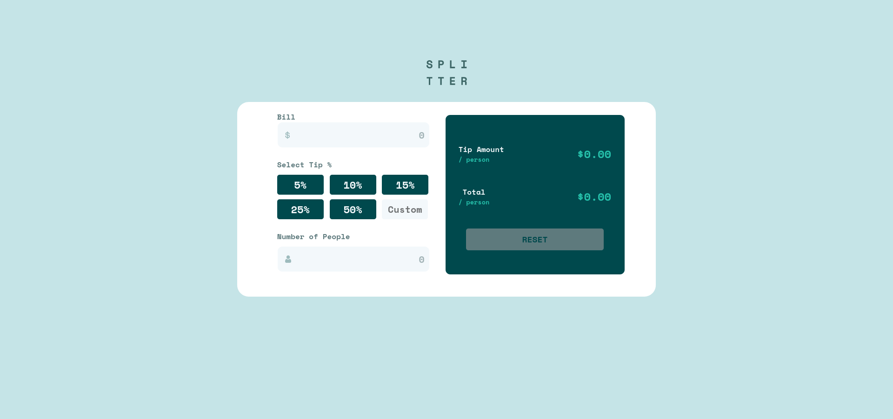

# Frontend Mentor - Tip calculator app solution

This is a solution to the [Tip calculator app challenge on Frontend Mentor](https://www.frontendmentor.io/challenges/tip-calculator-app-ugJNGbJUX). Frontend Mentor challenges help you improve your coding skills by building realistic projects.

## Table of contents

- [Overview](#overview)
  - [The challenge](#the-challenge)
  - [Screenshot](#screenshot)
  - [Links](#links)
- [My process](#my-process)
  - [Built with](#built-with)
  - [What I learned](#what-i-learned)
  - [Useful resources](#useful-resources)
- [Author](#author)

## Overview

### The challenge

Users should be able to:

- View the optimal layout for the app depending on their device's screen size
- See hover states for all interactive elements on the page
- Calculate the correct tip and total cost of the bill per person

### Screenshot

### Links

- Solution URL: [Add solution URL here](https://your-solution-url.com)
- Live Site URL: [Add live site URL here](https://your-live-site-url.com)

## My process
I started with HTML, but did the CSS along the way. The Javascript came after all of the CSS was finished.
I still struggle quite a bit with CSS, but I'm proud of how this turned out.

### Built with

- Semantic HTML5 markup
- CSS custom properties
- Flexbox
- CSS Grid
- Mobile-first workflow

### What I learned
How to use CSS Grid
Reinforced knowledge of JS
Learned the parseInt method.

### Useful resources

- [Learn CSS Grid with Kevin Powell](https://www.youtube.com/watch?v=rg7Fvvl3taU) - A great video that helped me understand the ins and outs of CSS Grid.
- [CSS Grid](https://css-tricks.com/snippets/css/complete-guide-grid/) - This helped me quickly reference how to use CSS Grid.

## Author

- Website - [Meobot](https://github.com/Meobot)
- Frontend Mentor - [@Meobot](https://www.frontendmentor.io/profile/Meobot)
- Twitter - [@Meobot](https://www.twitter.com/meobot)
